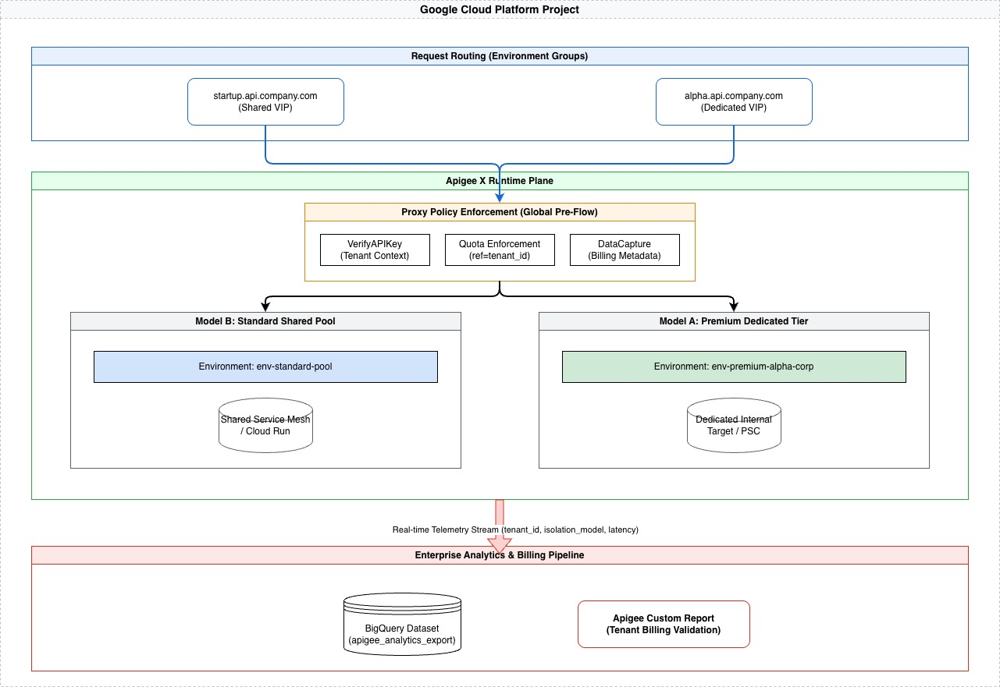

# Enterprise Multi-Tenant Apigee X Architecture

This repository contains an end-to-end Infrastructure as Code (IaC) solution using Terraform to deploy a highly secure, multi-tenant Apigee X API Gateway environment on Google Cloud. 

The architecture supports both **Dedicated (Model A)** and **Shared (Model B)** tenancy models, complete with isolated Private DNS routing, tenant-specific quotas, automated enterprise billing pipelines via BigQuery, and strict cross-tenant data boundaries.

## 🎯 Core Architecture Pillars

*   **⚖️ Hybrid Isolation:** Choose between physical isolation (Dedicated Environments) for high-compliance tenants or logical isolation (Shared Pool) for cost-efficient scaling.
*   **🛡️ Hardened Security:** Implements Environment-level IAM, API Product entitlements, and BigQuery Row-Level Security (RLS) to prevent cross-tenant data leakage.
*   **📊 Transparent Billing:** Real-time telemetry extraction using DataCollectors, feeding into automated BigQuery pipelines for accurate per-tenant chargeback.
*   **⚡ Proactive Governance:** Built-in guardrails for Apigee platform limits, including automated revision pruning and high-cardinality quota management.

---

## 🖼️ Architecture Diagram



---

## 🏛️ Architectural Patterns

This solution solves the classic SaaS API Gateway problem: How do you provide dedicated vanity URLs and isolated billing for premium customers, while maintaining cost-efficiency for standard customers?

### Model A: Dedicated Infrastructure (Premium Tier)
For enterprise customers with strict compliance or high-throughput requirements (e.g., `alpha-corp`).
* **Compute Isolation:** Traffic is routed to a physically isolated Apigee Environment (`env-premium-alpha-corp`).
* **Network Isolation:** Dedicated Environment Group and routing table.
* **Custom DNS:** Receives its own dedicated DNS A-record (`alpha.api.company.com`).

### Model B: Shared Pool (Standard Tier)
For standard users, startups, and beta testers (e.g., `startup-inc`, `beta-corp`).
* **Compute Efficiency:** Multiple tenants share a single Apigee Environment (`env-standard-pool`), drastically reducing Google Cloud compute costs.
* **Logical Isolation:** Tenants are securely differentiated at runtime via Apigee API Keys and Developer App attributes.
* **Custom Vanity URLs:** Even though they share compute, each tenant still gets a dedicated vanity URL (e.g., `startup.api.company.com`) via a shared Environment Group routing table.

---

## 🔒 Security & Data Isolation

To prevent cross-tenant data leakage, the architecture enforces multiple layers of security:
1. **API Product Entitlements:** Validates that the API Key belongs to the correct Tier (Premium vs. Shared).
2. **Context Propagation (Header Injection):** During the `PreFlow`, the proxy extracts the immutable `tenant_id` attached to the Terraform-provisioned Developer App and securely injects it into a backend header (`X-Internal-Tenant-ID`).
3. **Availability Fences:** Quotas (e.g., 100 requests/min) and Spike Arrests (e.g., 30 requests/sec) are strictly enforced per tenant, preventing one tenant's traffic spike from impacting another's availability.

---

## ⚠️ Critical Multi-Tenant Scaling Limits

When designing your tenancy strategy, keep the following Apigee X platform limits in mind:

### 1. Environment & Org Constraints
* **Environment Cap:** Most subscriptions limit environments to **50-85 per Org**. This is the hard ceiling for **Model A (Dedicated)** scaling.
* **Proxy Deployments:** Total deployed revisions across all environments are typically capped at **1,500 - 3,000**.

### 2. Routing & Ingress Guardrails
* **Hostnames per Group:** Standard limit of **100 hostnames** per Environment Group. Scaling to thousands of vanity URLs requires multiple groups or wildcard DNS strategies.
* **Env Groups per Org:** Capped at **15-20**. You cannot provision a unique group for every tenant in high-scale scenarios.

### 3. Shared Logic & Analytics
* **DataCollectors:** Hard limit of **20 per Organization**. This architecture consumes 2 for core isolation logic, leaving 18 for business KPIs.
* **Proxy Bundle Size:** **15MB hard limit**. Shared proxies in Model B must remain lean; avoid embedding large libraries or static resources.
* **Quota High-Cardinality:** Using `tenant_id` as a quota identifier is supported, but unique identifiers in the millions can impact distributed cache performance during peak traffic.

### 4. Revision Management
* **Max Revisions:** **50 revisions** per API Proxy. CI/CD pipelines must include logic to prune old revisions to prevent deployment failures.

---

## 🛠️ Proxy Logic & Traffic Flow

The proxies in this architecture act as the "Enforcement Point" for multi-tenancy. When a request hits the gateway:
1. **Identification:** The `VerifyAPIKey` policy looks up the developer app.
2. **Metadata Extraction:** Custom attributes (e.g., `tenant_id`, `tier`) are retrieved from the app metadata.
3. **Routing:** A `RouteRule` with a condition (e.g., `verifyapikey.Verify-API-Key.tier == "premium"`) determines if the traffic stays in the shared pool or routes to a dedicated target.
4. **Policy Enforcement:** The `Quota` policy uses the `tenant_id` as a `ref` or `identifier`, ensuring that limits are tracked per customer rather than per proxy.

## 📈 Monitoring & Dashboards

To view the tenant-specific metrics within the Apigee UI:
1. Navigate to **Analyze > Custom Reports**.
2. Select the `tenant_billing_validation` report provisioned by Terraform.
3. **Dimensions:** Use the `tenant_id` dimension to group traffic, latency, and error rates by customer.
4. **Drill-down:** You can filter by `env_group_hostname` to see which vanity URLs are generating the most load.

---

## 📊 Enterprise Billing & Analytics

The solution automatically provisions a full enterprise data pipeline:
* **Apigee DataCapture:** Silently extracts `tenant_id` and `isolation_model` during API execution.
* **Apigee Custom Reports:** A dynamically generated UI dashboard (`tenant_billing_validation`) to visualize traffic per tenant.

---

## 🚀 Deployment Guide

### Prerequisites
1. A Google Cloud Project with Billing enabled (Apigee Evaluation tier requires this).
2. [Terraform](https://developer.hashicorp.com/terraform/downloads) installed locally.
3. Google Cloud SDK (`gcloud`) installed and authenticated.
 4. The user/Service Account executing the script must have the following IAM roles:
    * `Apigee Admin` (Full control over Apigee resources)
    * `Compute Network Admin` (To manage VPC peering and Load Balancing)
    * `DNS Administrator` (To manage vanity URL records)
    * `Service Usage Admin` (To enable required Google APIs)
    * `BigQuery Data Editor` (For billing pipeline setup)
    * `Project IAM Admin` (To assign service-linked roles)

### Step 1: Initialize and Apply Infrastructure
```bash
# 1. Authenticate to Google Cloud
gcloud auth application-default login
gcloud auth print-access-token # Ensure you have a valid token for local-exec scripts

# 2. Initialize Terraform
terraform init

# 3. Review the execution plan
terraform plan

# 4. Deploy the infrastructure
terraform apply
```

### Step 2: Deploy the Multi-Tenant Proxy
Once the infrastructure is ready, deploy the sample proxy to test the routing and isolation logic:
```bash
# Navigate to the proxy directory
cd samples/helloworld-proxy

# Deploy using the provided script (uses Apigee APIs)
./deploy.sh --project $PROJECT_ID --env env-standard-pool
```

### Step 3: Testing the Architecture
Test the vanity URL routing and tenant isolation using `curl`:

```bash
# Test Shared Tier (Model B)
curl -H "x-api-key: <STARTUP_API_KEY>" https://startup.api.company.com/hello

# Test Premium Tier (Model A)
curl -H "x-api-key: <ALPHA_CORP_API_KEY>" https://alpha.api.company.com/hello
```
