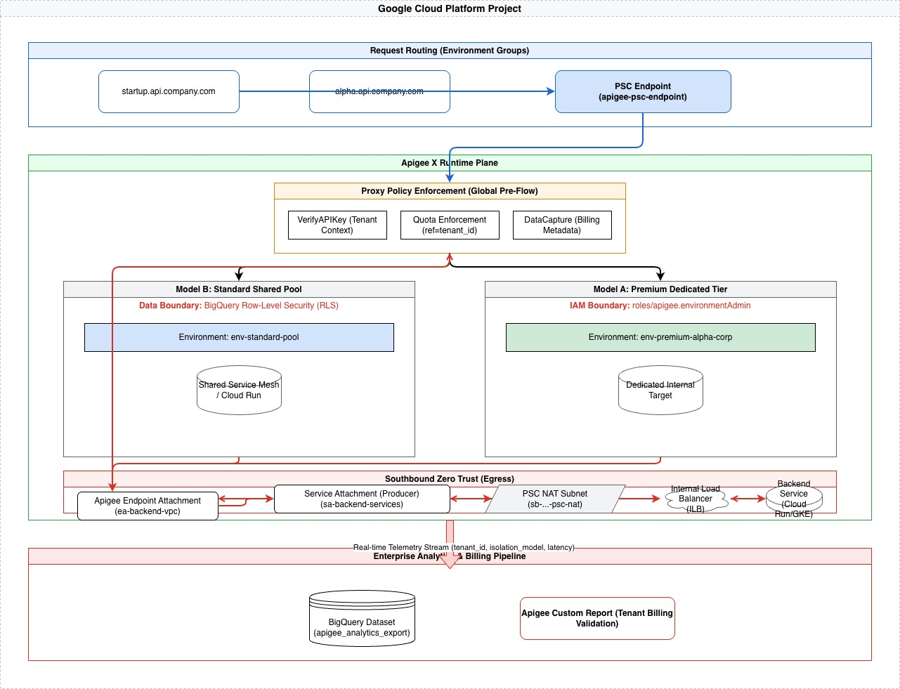

# Apigee X Private Service Connect (PSC) Architecture

This directory contains the "Zero Trust" implementation of the multi-tenant Apigee X infrastructure. Unlike standard VPC Peering, this design uses **Private Service Connect (PSC)** to eliminate transitive network trust and provide granular, service-based connectivity.

## 🏗️ Architecture Overview

The PSC implementation follows a dual-path connectivity model to ensure that traffic into and out of the Apigee runtime is strictly controlled and authenticated via identity.



### 1. Northbound Connectivity (Client to Apigee)
*   **Service Attachment:** Automatically provisioned by the Apigee Instance.
*   **PSC Endpoint:** A `google_compute_forwarding_rule` in the local VPC with a reserved internal IP.
*   **Global Access:** Enabled to allow cross-regional clients to reach the gateway.
*   **Private DNS:** Maps vanity URLs (e.g., `alpha.api.company.com`) to the internal PSC Endpoint IP.

### 2. Southbound Connectivity (Apigee to Backend)
*   **PSC NAT Subnet:** A dedicated subnet with the `PRIVATE_SERVICE_CONNECT` purpose, used to provide IPs for traffic exiting the Apigee management plane.
*   **Service Attachment (Producer):** Exposes your internal backends (via a Load Balancer) as a PSC Service.
*   **Endpoint Attachment:** Connects the Apigee Organization to your local Service Attachment, completing the Zero Trust loop.

### 3. Zero Trust Identity Layer
*   **Identity-Based Egress:** Apigee is configured with a dedicated Google Service Account. 
*   **OIDC Auth:** Traffic sent to backends can be secured with OIDC ID tokens, shifting security from "Network Location" to "Cryptographic Identity."

---

## 🛡️ Key Security Features

| Feature | Implementation | Benefit |
| :--- | :--- | :--- |
| **Network Isolation** | Dedicated Subnet (`sb-...-apigee`) | Prevents lateral movement within the VPC. |
| **Service Access** | `consumer_accept_list` | Restricts which projects can create endpoints to your instance. |
| **Admin Siloing** | Environment-Level IAM | Ensures Tenant A admins cannot see Tenant B's environment. |
| **Data Integrity** | BigQuery RLS | Restricts analytics data visibility based on `tenant_id`. |

---

## 📁 Directory Structure

*   `main.tf`: Core PSC infrastructure, networking, and Apigee resources.
*   `variables.tf`: Schema for project config and multi-tenant maps.
*   `providers.tf`: Google and Google-Beta provider configurations.
*   `terraform.tfvars`: Sample tenant data (Rename to `.tfvars` for use).
*   `backend.tf`: Configuration for GCS state storage.

---

## 🚀 Getting Started

### 1. Configure Backend state
Update `backend.tf` with your GCS bucket name to ensure your state is stored securely.

### 2. Define your Tenants
Update `terraform.tfvars` with your specific Model A and Model B customers.

### 3. Initialize and Deploy
```bash
# Initialize providers and backend
terraform init

# Review the PSC-specific plan
terraform plan

# Provision the infrastructure
terraform apply
```

### 4. Post-Deployment Verification
Verify the PSC endpoint status:
```bash
gcloud compute forwarding-rules describe apigee-psc-endpoint --region <YOUR_REGION>
```

---

*Note: This architecture assumes the presence of a "default" VPC network as the base for the dedicated Apigee subnets.*